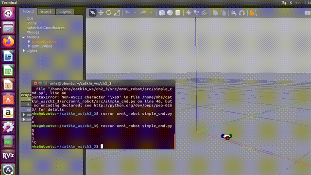

- code for three wheeled omnidirectional robot
- 1) 第一步，创建ROS package:omni_robot
-    cd catkin_ws/src
-    catkin_create_pkg omni_robot
-    cd omni_robot
-    mkdir src meshes urdf rviz launch
- 2) 第二步，拷贝文件到对应目录，包括从https://github.com/GuiRitter/OpenBase 网站拷贝omnidirectional robot对应的STL和DAE格式的CAD文件到meshes目录，description.rviz文件到rviz目录，description.urdf文件到urdf目录。
-   (*注意修改description.urdf里面的文件路径)
- 3) 编写launch文件并运行测试
-    display.launch文件内容：
- `<launch>`
-
-  ` <arg name="model" />`
-   `<arg name="gui" default="True" />`
- 
-   `<!-- Load the URDF to the parameter server -->`
-   `<param name="robot_description" command="$(find xacro)/xacro --inorder '$(find omni_robot)/urdf/description.urdf'" />`
-   `<!--param name="use_gui" value="$(arg gui)" /-->`
- 
-   `<!--node name="joint_state_publisher" pkg="joint_state_publisher" type="joint_state_publisher" /-->`
-   `<node name="robot_state_publisher" pkg="robot_state_publisher" type="robot_state_publisher" />`
-   `<node name="rviz" pkg="rviz" type="rviz" args="-d $(find omni_robot)/rviz/description.rviz" required="true" />`
- 
- `</launch>`
-   将launch文件存放到launch目录。返回到catkin_ws目录下运行编译命令：
-   catkin_make
-   加载ROS包的运行环境：
-   source devel/setup.bash
-   运行测试命令：
-   roslaunch omni_robot display.launch
-   发送rostopic:
-   rostopic pub /joint_states sensor_msgs/JointState '{header: {stamp: now, frame_id: ''},name: [ 'origin_joint', 'left_rim_joint', 'left_roller_e_joint', 'left_roller_ne_joint', 'left_roller_n_joint', 'left_roller_nw_joint', 'left_roller_w_joint', 'left_roller_sw_joint', 'left_roller_s_joint', 'left_roller_se_joint', 'back_rim_joint', 'back_roller_e_joint', 'back_roller_ne_joint',  'back_roller_n_joint', 'back_roller_nw_joint', 'back_roller_w_joint', 'back_roller_sw_joint', 'back_roller_s_joint', 'back_roller_se_joint', 'right_rim_joint', 'right_roller_e_joint', 'right_roller_ne_joint', 'right_roller_n_joint', 'right_roller_nw_joint', 'right_roller_w_joint', 'right_roller_sw_joint', 'right_roller_s_joint', 'right_roller_se_joint'],position:[0, 0, 0, 0, 0, 0, 0, 0, 0, 0, 0, 0, 0, 0, 0, 0, 0, 0, 0, 0, 0, 0,0, 0, 0, 0, 0, 0], velocity:[], effort:[]}' --once
-   gazebo运动控制仿真请参见教程pdf文档
-   

